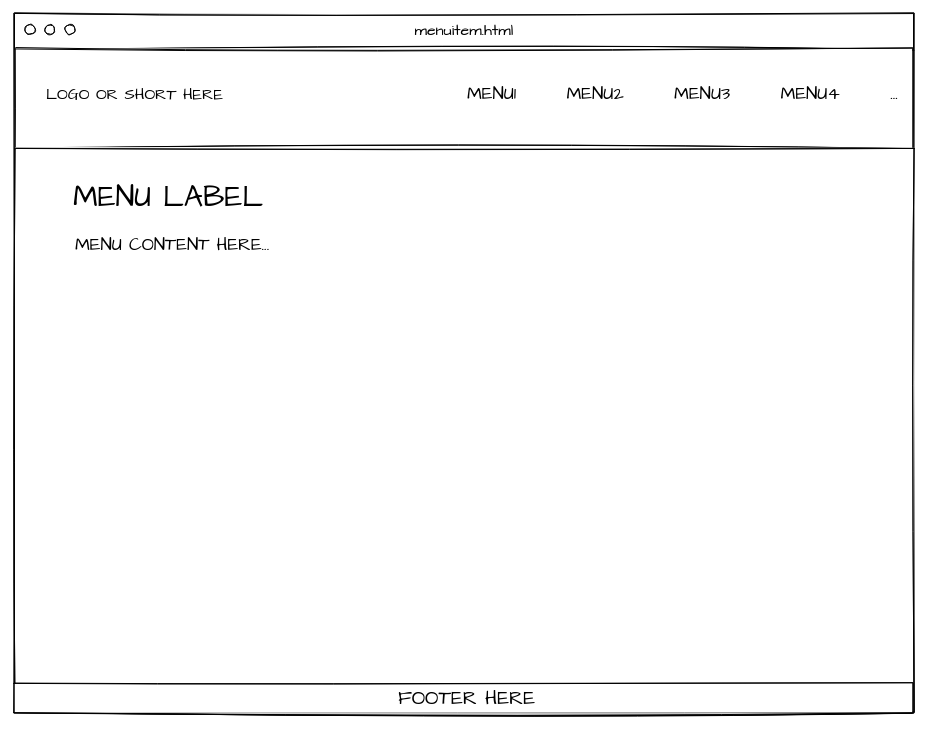

# MAKE-A-SIMPLE-WEBSITE-USING-HTML-AND-CSS
 
**Tervezet**

Az oldalon kétféle oldal típus jelenik meg. A főoldal és a mellékoldalak.

A főoldal tervezett felépítése:

A mellékoldalak tervezett felépítése:

Az oldalon található elemeket HTML-ben kell megvalósítani míg a stílust és elhelyezkedést érintő formázásokat CSS használatával kell definiálni.
